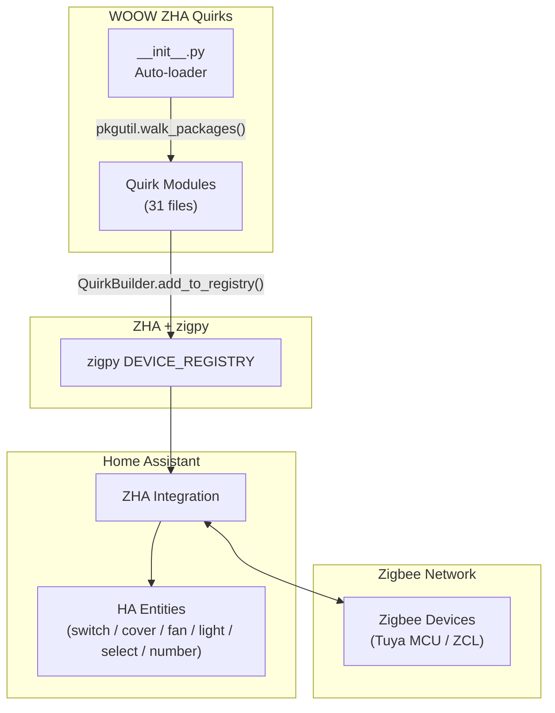

<p align="center">
  
</p>

<h1 align="center">WOOW ZHA Quirks</h1>

<p align="center">
  <strong>Centralized custom ZHA quirks package for Tuya & Simon Zigbee devices with full HA entity support</strong>
</p>

<p align="center">
  <a href="#supported-devices">Supported Devices</a> &bull;
  <a href="#dp-map-reference">DP Map Reference</a> &bull;
  <a href="#architecture">Architecture</a> &bull;
  <a href="#installation">Installation</a> &bull;
  <a href="#configuration">Configuration</a> &bull;
  <a href="#project-structure">Project Structure</a> &bull;
  <a href="#development">Development</a> &bull;
  <a href="#license">License</a>
</p>

<p align="center">
  
  
  
  
  
  
</p>

<p align="center">
  <a href="https://my.home-assistant.io/redirect/hacs_repository/?owner=WOOWTECH&repository=Woow_ha_zha_quirk_component&category=integration">
    
  </a>
</p>

---

## Supported Devices

> The **Quirk File** column shows the file under `quirks/`, named `{model}_{type}_{manuf-suffix}.py`
> (Simon-brand devices use a `simon_{model/series}_{type}.py` variant). One file may register several
> `(manufacturer, model)` signatures. 32 files register 43 signatures in total.

| # | Device | Model | Manufacturer ID | Quirk File | HA Platform | Key Features |
|---|--------|-------|-----------------|------------|-------------|--------------|
| 1 | Simon i7 S2100-1001 | 1-Gang Smart Switch | `_TZ2000_sayvzx8wgxqoxfuj` | `simon_i7_s2100.py` | `switch` | Indicator LED mode |
| 2 | Simon i7 S2100-1002 | 2-Gang Smart Switch | `_TZ2000_vvxwtxzf96vvarzj` | `simon_i7_s2100.py` | `switch` | Indicator LED + All On/Off virtual endpoint |
| 3 | Simon i7 S2100-1003 | 3-Gang Smart Switch | `_TZ2000_bi57zocaqionffns` | `simon_i7_s2100.py` | `switch` | Indicator LED + All On/Off virtual endpoint |
| 4 | Simon i7 S2100-1004 | 4-Gang Smart Switch | `_TZ2000_o1yvtxphiwt5cwif` | `simon_i7_s2100.py` | `switch` | Indicator LED + All On/Off virtual endpoint |
| 5 | Tuya TS0001 | 1-Gang Switch Module | `_TZ3000_tqlv4ug4` (also `_TZ3000_tuucc0f5`, `_TZ3000_voy7mbpw`, `_TZ3000_6m2xazd1` = 新版零火智能開關-1開) | `ts0001_switch_TZ3000_tqlv4ug4.py` | `switch` | Light-to-switch fix, external switch type, power-on state, indicator mode, firmware suppressed |
| 6 | Tuya TS0002 | 2-Gang Switch Module | `_TZ3000_denobasq` (also `_TZ3000_vnzfigh4` = 新版零火智能開關-2開, `_TZ3000_zbzxnuaq`) | `ts0002_switch_TZ3000_denobasq.py` | `switch` | Light-to-switch fix (ON_OFF_SWITCH), **Tuya spell (EnchantedDeviceV2) so the two gangs stay independent** — without it the device echoes a report from every endpoint on any command and both gangs toggle together (#1580/#1613), global power-on state, indicator mode, firmware suppressed |
| 7 | Tuya TS0601 Roller Shade | Roller Shade Motor | `_TZE284_qxjkdfyt` | `ts0601_cover_TZE284_qxjkdfyt.py` | `cover` | Motor direction, limit switches, motor mode |
| 8 | Tuya TS0601 Ceiling Fan | Ceiling Fan + Light | `_TZE200_hmgktzj2` | `ts0601_fan_TZE200_hmgktzj2.py` | `fan` + `light` + `select` | 6-speed fan, 3 presets, direction control, 3-level color temp |
| 9 | Gledopto GL-SPI-206P | SPI LED Controller | `_TZE284_gt5al3bl` | `ts0601_light_TZE284_gt5al3bl.py` | `light` | RGBCW color, **44 scenes as light effects** (full app library), pixel count, chip type config |
| 10 | Zemismart 4-Gang Screen Switch | 4-Gang Touch Switch | `_TZE204_wwaeqnrf` | `ts0601_switch_TZE204_wwaeqnrf.py` | `switch` | Screen label auto-sync, countdown timer, child lock, LED colors |
| 11 | Tuya Curtain Track | Curtain Track Motor | `_TZE200_nogaemzt` | `tuya_cover_nogaemzt.py` | `cover` | Motor direction, limit switches, motor mode |
| 12 | Simon SM0502 | 2-Gang Dimmer Switch | `_TZ2000_qc1ntn3c` | `simon_sm0502_dimmer.py` | `light` + `number` | Min/max brightness split, All On/Off virtual endpoint, indicator LED |
| 13 | Tuya TS0502B | CCT Dimmable Light | `_TZ3000_yeygk4hw` | `ts0502b_cct_TZ3000_yeygk4hw.py` | `light` | Kelvin↔mireds auto-conversion, CCT-only mode fix (2500-6500K) |
| 14 | Simon SM0301 | 1-CH Curtain Controller | `_TYZB01_koulgwmy` | `simon_sm0301_curtain.py` | `cover` + `number` | Phantom EP2-4 removal, binary_sensor suppression, OnOff→Level open/close redirect, **time-based positioning** (accurate intermediate positions; native level positioning is nonlinear), no "device did not respond", Travel Time in seconds (1-180 s) |
| 15 | Tuya 3-Gang Screen Switch | 3-Gang Touch Switch | `_TZE204_k7v0eqke` | `ts0601_switch_TZE204_k7v0eqke.py` | `switch` | Screen label auto-sync, countdown timer, child lock, LED colors |
| 16 | Simon 10-66E8025 | TS0726 8-Gang Scene+Switch Panel | `_TZ3210_5nd2aydx` | `ts0726_scene_switch_TZ3210_5nd2aydx.py` | `switch` + `select` | 8 switches mapped EP1-8 = physical switches 1-8 (phantom EP9 removed), all gangs force-set to regular-relay (Switch) mode on startup — scene mode disabled, mode selects removed (0xE001 0xD020), indicator LED mode, dead StartUpOnOff selects suppressed, firmware entities collapsed to 1 |
| 17 | Simon i7 17-70E857TY | TS1002 0-10V Smart Dimming Remote Switch (2-gang) | `_TZ3000_qe3d5gga` | `simon_i7_70e857ty_dimmer.py` | `binary_sensor` + `select` | 2 gang On/Off **binary_sensors** (Gang 1 / Gang 2) that **mirror** the physical wall-switch state — device is a remote whose server OnOff rejects on/off (`UNSUP_CLUSTER_COMMAND`), so the control-less default switches are suppressed and replaced with read-only binary_sensors; single device-global Status Light indicator mode (Close / Switch Status / Switch Position), Identify button + duplicate firmware/OTA entities removed, dead StartUpOnOff selects suppressed |
| 18 | Simon 4-58E8017 | TS0034 Rotary CCT Knob (controller) | `_TZ3000_ocqo8iwd` | `simon_58e8017_knob.py` | `zha_event` + `binary_sensor` + `sensor` ×2 | Rotary knob remote — press → OnOff `on`/`off`, rotate → LevelControl `step` (up/down), colour-mode rotate → **Tuya `0xE0`** decoded to a clean `tuya_set_color_temp` event (cluster 768, `temp_value` 0-1000). Also exposes 3 read-only **entities** reflecting its actions: On/Off `binary_sensor`, Colour Temperature `sensor` (0–100%), Brightness `sensor` (0–100%, approx). Stock Identify button + firmware/OTA `update` entity suppressed. **Needs a group bind** (knob multicasts to group `0x2760`; ZHA's unicast bind-to-coordinator is ignored by the Tuya firmware) — **the component now creates this automatically** on (re-)pair, plus a `woow_zha_quirks.rebind_knob` service to force it (see `knob_rebind.py`) |
| 19 | Simon 2-58E8002 | 2-Gang Smart Switch | `_TZ2000_euqqstyrbiynph3m` | `simon_58e8002_switch.py` | `switch` + `select` | 2 native OnOff gangs; `TuyaZBOnOffAttributeCluster` surfaces the indicator LED mode (Close / Switch Status / Switch Position); dead StartUpOnOff + firmware/OTA entities suppressed |
| 20 | Simon 3-70E8304 (S2100-1004 variant) | 4-Gang Smart Switch | `_TZ2000_kgwm3i4o4klbuaks` | `simon_i7_s2100.py` | `switch` | Second 4-gang variant registered by the Simon i7 builder; Indicator LED + All On/Off virtual endpoint |
| 21 | Simon 6-66E8003 | 3-Gang Smart Switch | `_TZ3210_z9wuslixqsbfizut` | `ts0003_switch_TZ3210_z9wuslixqsbfizut.py` | `switch` + `select` | 3 native OnOff gangs; phantom EP4-9 removed; indicator LED mode select; StartUpOnOff + firmware/OTA suppressed |
| 22 | Simon 7-58E8021 | TS0034 6-Gang Scene Panel (as plain switches) | `_TZ3000_hebcnahz` | `simon_58e8021_switch.py` | `switch` + `select` | 6 gangs as plain switches; `ScenePressOnOffCluster` catches the physical-press `0xFB` command and toggles the server OnOff so state follows; indicator LED select; StartUpOnOff + firmware/OTA suppressed; per-button scene `zha_event` intentionally out of scope |
| 23 | Simon 8-58E7101 | SM0308C Fan-Coil Thermostat | `_TZ2000_cykrrj2x` | `sm0308c_climate_TZ2000_cykrrj2x.py` | `switch` + `number` + `select` ×3 + `sensor` | Standard-ZCL fan-coil thermostat; `SM0308CThermostat` adds a custom `sleep_mode` (0x9002); `system_mode` uses device-custom enum 0/1/2 (cool/heat/fan); default `climate` entity hidden |
| 24 | Simon 9-241E8008TY | TS0726 4-Gang Scene Panel (as plain switches) | `_TZ3002_v0xabl0o` | `ts0726_scene_switch_TZ3002_v0xabl0o.py` | `switch` + `select` | 4 gangs forced to Switch mode on startup (`gang_mode`=0 on 0xE001/0xD020) so the indicator LED works; press → OnOff report (no scene pulse); StartUpOnOff ×4 + firmware ×4 suppressed |
| 25 | Simon 11-241E8003TY | TS0003 3-Gang Switch | `_TZ3002_wt4t1anwyef42zv4` | `ts0003_switch_TZ3002_wt4t1anwyef42zv4.py` | `switch` + `select` | device_type override 0x0100→0x0004 (Light→Switch) + drops the redundant "Opening" binary_sensor; indicator LED select; StartUpOnOff + firmware/OTA suppressed |
| 26 | Tuya 12-70E8306 | TS0022 2-Gang Scene Switch | `_TZ3000_klkkwshz` | `ts0022_scene_switch_TZ3000_klkkwshz.py` | `switch` + `select` | 2 native OnOff gangs; `ScenePressOnOffCluster` catches the physical-press `0xFB` and toggles state; `TuyaZBOnOffAttributeCluster` surfaces the indicator LED select; dead StartUpOnOff suppressed |
| 27 | Simon 14-66E7109TY | SM0308F HVAC/AC Panel | `_TZC200_qbuzgrdocufrqgdu` | `sm0308f_climate_TZC200_qbuzgrdocufrqgdu.py` | `switch` + `number` + `select` ×3 + `binary_sensor` + `sensor` ×5 | Hybrid ZCL + Tuya-DP AC panel — standard OnOff/Fan writes are ACK-then-ignored, so power/fan/mode/scenario go via DP130/115/116/152; `SM0308FMCUCluster` flips the mis-directed DP report direction bit; also ships a wrapping `climate` entity via `climate.py` |
| 28 | Simon 15-66E8015 | TS110D 1-Gang Dimmer | `_TZ3210_1znecg8a` | `ts110d_dimmer_TZ3210_1znecg8a.py` | `light` + `number` ×2 + `select` | Simon M7 single-gang dimmer; `TS110DLevelControl` mirrors the Tuya 0xF000 report to standard `current_level` (same 0-254 domain, no rescale) so wall-dim reflects in HA; min/max brightness shown as %; indicator LED select |
| 29 | Zemismart 18-ZM25TQ | TS0601 Roller Shade Motor | `_TZE200_fzo2pocs` | `ts0601_cover_TZE200_fzo2pocs.py` | `cover` + `switch` | Tubular roller-shade motor; `invert=True`; upper/lower limits can only be taught with the physical remote (not settable over Tuya app/network); DP106 motor_mode hidden and pinned to Linkage |
| 30 | Tuya 19-BCM500DS | TS0601 Curtain Track | `_TZE200_rmymn92d` | `ts0601_cover_TZE200_rmymn92d.py` | `cover` + `switch` + `binary_sensor` + `sensor` | Curtain track; `ReversedControlCover` swaps open↔close (DP1 direction is inverted vs the declared enum) while keeping the DP2/DP3 position pipe correct; `invert=True`; DP11 full-travel time + DP10 motor-fault diagnostics |
| 31 | Tuya 20-BCM100DB | TS0601 Curtain Track | `_TZE200_eegnwoyw` | `ts0601_cover_TZE200_eegnwoyw.py` | `cover` + `switch` + `binary_sensor` + `sensor` | Sibling of 19-BCM500DS — identical DP layout and `ReversedControlCover` / `invert=True` workaround |
| 32 | Tuya 21-TYZGTH1CH-D1RF | TS000F 1-CH Temp/Humidity Controller | `_TZ3218_7fiyo3kv` | `ts000f_temphum_ctrl_TZ3218_7fiyo3kv.py` | `switch` + `sensor` ×4 + `number` ×4 + `select` | Hybrid: the relay is **standard ZCL OnOff** (DP1 is an echo-only mirror whose writes are ignored), while temp/humidity + calibration ride the 0xEF00 DPs; `replaces_endpoint` makes the relay a `switch`; OnOff bind/report kept so relay state pushes |
| 33 | WOOW WO_40117 (MTG235-ZB-RL) | TS0601 mmWave Human-Presence Sensor + relay | `_TZE204_clrdrnya` | `ts0601_presence_TZE204_clrdrnya.py` | `binary_sensor` + `sensor` ×4 + `number` ×8 + `select` ×5 | 24 GHz radar occupancy (`binary_sensor`) + target-distance/illuminance sensors + built-in breaker (relay) mode/status/polarity selects + full radar tuning `number`s. Reproduces the proven upstream `zhaquirks.tuya.tuya_motion` map but **corrects two app-scale bugs** (illuminance ÷10, entry filter-time ÷100), adds self-test (DP6) + parameter-result (DP113) diagnostics, and suppresses the inert firmware/OTA entity. Upstream also ships a **v2** quirk for this signature, so `quirk_priority.py` keeps the woow quirk authoritative (demotes the competing upstream v2 registration) |
| 34 | WOOW 新版零火智能開關-3開 | TS0003 3-Gang Switch Module | `_TZ3000_ip6y7jj0` | `ts0003_switch_TZ3000_ip6y7jj0.py` | `switch` ×3 + `select` ×2 | 3-gang sibling of the 1開/2開; overrides device_type 0x0100→ON_OFF_SWITCH so all 3 become `switch`, **Tuya spell (EnchantedDeviceV2) keeps the three gangs independent** (without it any command toggled all gangs together — #1580/#1613), `WoowIndicatorMode` indicator select + single **global** power-on select (EP2/EP3 0x8002 return UNSUPPORTED over ZHA; per-gang restart status is a Tuya-gateway DP feature, not ZCL-reachable), firmware/OTA suppressed |
| 35 | WOOW 新版單火智能開關-1開 (WO_50804_1S) | TS0011 1-Gang Switch (single-live-wire 單火) | `_TZ3000_2xmrrjir` | `ts0001_switch_TZ3000_tqlv4ug4.py` | `switch` | Single-fire 1開; device_type 0x0100→ON_OFF_OUTPUT (Light→Switch) + `TuyaZBOnOffAttributeCluster`; indicator (0x8001) and power-on (0x8002) selects **intentionally omitted** — this firmware ACKs the ZCL writes but never applies them and has no `0xEF00` DP channel over ZHA, so exposing them would be misleading non-functional controls; firmware/OTA suppressed |
| 36 | WOOW 新版單火智能開關-3開 | TS0013 3-Gang Switch (single-live-wire 單火) | `_TZ3000_dqf2oiyz` | `ts0003_switch_TZ3000_ip6y7jj0.py` | `switch` ×3 | Single-fire twin of the 零火 3開 (`_TZ3000_ip6y7jj0`); device_type 0x0100→ON_OFF_SWITCH on all three gangs + **Tuya spell (EnchantedDeviceV2) keeps the gangs independent**; indicator/power-on selects omitted (single-fire firmware ACKs-but-ignores them, no `0xEF00` DP channel); firmware/OTA suppressed |
| 37 | WOOW WO_40116 (MTG275-ZB-RL) | TS0601 mmWave Human-Presence Sensor + relay (ceiling 吸頂式) | `_TZE204_dtzziy1e` | `ts0601_presence_TZE204_dtzziy1e.py` | `binary_sensor` + `sensor` ×4 + `number` ×8 + `select` ×5 | Ceiling-mounted sibling of 33-WO_40117 (`_TZE204_clrdrnya`); the Tuya thing-model is byte-for-byte identical, so it **mirrors the clrdrnya DP map verbatim** (same illuminance ÷10 / entry-filter ÷100 corrections) and adds DP6 self-test + DP113 parameter-result diagnostics; inert firmware/OTA entity suppressed |
| 38 | WOOW WO_50801_5 | TS130F Dry-Contact Curtain Module (窗簾比例模組) | `_TZ3000_9hadsgq9` | `ts130f_cover_TZ3000_9hadsgq9.py` | `cover` + `select` + `number` | Standard-ZCL WindowCovering curtain switch (the Tuya `clkg` DPs are translated to ZCL 0x0102 by the gateway MCU, so ZHA builds the cover natively); `WoowTS130FCover` swaps `up_open`↔`down_close` (this firmware runs open/close inverted while position set/report stays correct); Motor Direction select (0xF002) + Calibration Time number (0xF003 is stored in **deciseconds** → `multiplier=0.1` shows real seconds 1-900 s, 0.1 s steps, decimals supported, writable at **any** cover position unlike the app); window-covering-type + firmware/OTA entities suppressed |
| 39 | Simon 241E8016TY | TS0052 2-Gang Dimmer | `_TZ3002_cqpubrcz` | `ts0052_dimmer_TZ3002_cqpubrcz.py` | `light` ×2 + `select` + `sensor` ×4 | Standard-ZCL 2-gang dimmer (both endpoints are real gangs, no Tuya `0xEF00`); on/off + brightness per gang + indicator LED mode (OnOff 0x8001). **Min/max brightness are read-only — sniffer-proven**: an nRF52840 capture of the Tuya gateway changing min/max in the app writes standard MinLevel/MaxLevel (0x0002/0x0003) and the device rejects **every** write with ZCL `READ_ONLY` (0x88) (30/30), so even the app slider is non-functional; (unlike the TS110D sibling) there is **no** writable Tuya min/max attr and no `0xEF00` DP — surfaced as read-only `%` `sensor`s. **Power-on behaviour/level removed** (StartUpOnOff 0x4003 / StartUpCurrentLevel 0x4000 are ACKed+stored but never applied at power-up, and the app has no power-on setting for this SKU — dead controls). Transition-time/on-level/move-rate + duplicate Tuya power-on/child-lock + per-endpoint firmware/OTA suppressed |

---

## DP Map Reference

### Simon i7 S2100 Series

Standard ZCL switches (genOnOff), NOT Tuya MCU devices.

| Feature | Cluster | Attribute | Entity Type | Description |
|---------|---------|-----------|-------------|-------------|
| Switch (per gang) | 0x0006 | `on_off` | Standard | On/Off control |
| Indicator Mode | 0x0006 | `backlight_mode` (0x8001) | Config | Off / Normal / Inverted |
| All On/Off | 0x0006 (EP 200) | `on_off` | Standard | Virtual endpoint, multi-gang only |

---

### Simon i7 17-70E857TY (`_TZ3000_qe3d5gga`, model `TS1002`)

Standard ZCL device (NOT Tuya MCU). A 0-10V **dimming remote switch** (2-gang): the
wall unit pairs with a separate Simon 0-10V converter module that drives the actual
lamp. Profile/device_type `0x0104` (DIMMER_SWITCH), two identical gang endpoints (1, 2).

| Feature | Cluster | Attribute | EP | Entity Type | Description |
|---------|---------|-----------|-----|-------------|-------------|
| Gang 1 / Gang 2 state | 0x0006 | `on_off` | 1, 2 | `binary_sensor` (Standard) | Read-only on/off mirror of the physical gang state |
| Status Light | 0x0006 | `backlight_mode` (0x8001) | 1 | Config (`select`) | Close (0, off) / Switch Status (1, LED on when gang ON) / Switch Position (2, LED on when gang OFF) |

**Control note (operator-verified):** the device is a *remote* — its server OnOff
cluster rejects `on`/`off` commands (`UNSUP_CLUSTER_COMMAND`), so a `switch` entity could
never drive it. The quirk therefore **suppresses the default switches and exposes the two
gang states as read-only `binary_sensor` entities** (Gang 1 / Gang 2) that mirror the
physical wall-switch state. The real 0-10V load is controlled by the separate Simon
converter module, which is not part of the ZHA network. The LevelControl (slide-dim) and
Color output clusters are left unexposed (entity set = 2 binary_sensors + 1 Status Light
select). A sniff of the gang presses shows each
gang emits a standard OnOff On/Off — so the presses can alternatively be used as HA
`zha_event` triggers by binding each gang's OnOff output to the ZHA coordinator.

---

### Simon 4-58E8017 (`_TZ3000_ocqo8iwd`, model `TS0034`)

Tuya **rotary CCT knob controller** (device_type `0x0105`, EP1 output clusters
OnOff/LevelControl/ColorControl).  It is a remote that **emits commands** which become
`zha_event`s for automations to control any HA `light`, and the quirk also exposes a few
**read-only entities** that mirror its actions.  The exact protocol was established by
sniffing the Tuya gateway:

| Gesture | Cluster | Command → `zha_event` | Payload |
|---------|---------|-----------------------|---------|
| Short-press | 0x0006 OnOff | `on` / `off` | stateful |
| Rotate (brightness) | 0x0008 Level | `step` | `params.step_mode` 0 up / 1 down, `params.step_size` |
| Rotate (colour mode) | 0x0300 Color | `tuya_set_color_temp` (**Tuya 0xE0**) | `params.temp_value` 0..1000 |

The quirk replaces EP1's Color *output* cluster with `KnobColorCluster` (declares the Tuya
`0xE0` command so ZHA decodes it; mirrors the value to a synthetic attribute) and the Level
*output* cluster with `KnobLevelCluster` (accumulates relative `step` into a 0..254 level);
OnOff stays standard (ZHA tracks `on_off` natively).  **Read-only entities** created (they
reflect the knob's actions — an input device — and cannot control it):

| Entity | Source | Notes |
|--------|--------|-------|
| `binary_sensor` On/Off | OnOff client `on_off` (synthesized) | tracks the physical press AND flips **on** when the user rotates (brightness/colour changes) / **off** when brightness reaches 0 — matching the habit that rotating drives the bound light |
| `sensor` Colour Temperature | Color client `0xE0` → % | absolute (accurate); temp_value 0..1000 mapped 0–100% (0% = warm) |
| `sensor` Brightness (approx) | Level client `step` accumulator | relative 0–100%, may drift |

The stock Identify `button` and firmware/OTA `update` entity are **suppressed** (no real use on a
controller).

**Setup (now automatic, verified 2026-06-29):** this Tuya firmware only emits to a multicast
**group** and **ignores** ZHA's standard unicast bind-to-coordinator.  A working setup needs:
(1) a ZHA group `0x2760` with the **coordinator** as a member; (2) a ZDO group-bind of ep1
OnOff(6)/Level(8)/Color(768) → that group.  A re-pair wipes the knob's bind, which is why the
sensors go "Unknown".  **The component now does this for you** (`knob_rebind.py`): it watches
for the knob to (re-)pair and recreates the group + group-bind automatically, and registers a
`woow_zha_quirks.rebind_knob` service to force it on demand.  The coordinator IEEE is
auto-discovered and the knob is matched by manufacturer/model, so it works on any server.

> Note: the **first** time the group is created the coordinator radio's multicast table may
> need one ZHA reload/restart to take effect; once the group is persisted by ZHA it is
> re-applied on every startup, so later re-pairs are bound automatically with no reload.

---

### Simon SM0502 (`_TZ2000_qc1ntn3c`)

Standard ZCL 2-gang dimmer (NOT Tuya MCU). Silicon Labs EFR32MG24 chip. Device exposes 4 endpoints but only EP1 & EP2 are real physical gangs; EP3 & EP4 are phantom and removed by the quirk.

| Feature | Cluster | Attribute | EP | Entity Type | Description |
|---------|---------|-----------|-----|-------------|-------------|
| Light (per gang) | 0x0006 + 0x0008 | `on_off` + `current_level` | 1, 2 | Standard (light) | Dimmable light, brightness 0-254 |
| Indicator Mode | 0x0006 | `backlight_mode` (0x8001) | 1 | Config | Off / Normal / Inverted |
| Min Brightness | 0x0008 | `min_brightness` (virtual 0xFC10) | 1, 2 | Config (number) | Per-gang min brightness (0-255) |
| Max Brightness | 0x0008 | `max_brightness` (virtual 0xFC11) | 1, 2 | Config (number) | Per-gang max brightness (0-255) |
| All On/Off | 0x0006 (EP 200) | `on_off` | 200 | Standard | Virtual endpoint, controls both gangs |

**Min/Max Brightness Technical Detail:**

The device stores min and max brightness in a single packed uint16 attribute `0xFC00`:
- High byte = min brightness (0x00-0xFF)
- Low byte = max brightness (0x00-0xFF)
- Example: `0x4DFF` = min 77 (~30%), max 255 (100%)

The quirk splits this into two virtual attributes (`0xFC10` / `0xFC11`) as separate number entities. Writes to either virtual attribute perform read-modify-write on the underlying `0xFC00`.

---

### Tuya TS0502B (`_TZ3000_yeygk4hw`)

Standard ZCL CCT dimmable light (NOT Tuya MCU). Silicon Labs EFR32MG24 chip. The device reports color temperature attributes in **Kelvin** instead of ZCL-standard **mireds**; the quirk converts automatically.

| Feature | Cluster | Attribute | Entity Type | Description |
|---------|---------|-----------|-------------|-------------|
| Light | 0x0006 + 0x0008 | `on_off` + `current_level` | Standard (light) | Dimmable CCT light, brightness 0-254 |
| Color Temperature | 0x0300 | `color_temperature` (0x0007) | Standard (light) | 2500-6500K, auto Kelvin↔mireds conversion |
| Color Capabilities | 0x0300 | `color_capabilities` (0x400A) | — | Forced to 0x10 (CCT only, removes xy mode) |

**Kelvin↔Mireds Conversion:**

The device stores color temperature in Kelvin but ZCL expects mireds (1,000,000 / K). The quirk converts transparently:
- **Reads**: Kelvin (from device) → mireds (to ZHA/HA)
- **Writes**: mireds (from HA) → Kelvin (to device)
- **Commands**: `move_to_color_temperature` command also converted

| Device Attribute | Device Value | Quirk Output |
|------------------|-------------|--------------|
| `color_temperature` (0x0007) | 5499 (Kelvin) | 181 (mireds) → HA shows 5524K |
| `color_temp_physical_min` (0x400B) | 2500 (Kelvin) | 400 (mireds) → HA shows 2500K |
| `color_temp_physical_max` (0x400C) | 6500 (Kelvin) | 153 (mireds) → HA shows 6535K |

---

### Simon SM0301 (`_TYZB01_koulgwmy`)

1-channel curtain controller with forward/reverse relay output. Standard ZCL Shade device (device_type 0x0200) using OnOff + LevelControl clusters.

**Problem:** Device reports 4 identical endpoints (EP1-EP4) but only EP1 is functional. Creates ~22 entities without quirk. Quirk removes EP2-4, suppresses config entities + the redundant OnOff "opening" binary_sensor, and fixes two firmware quirks in ZHA's `Shade` cover mapping (below), leaving a clean cover plus one travel-time control.

| Feature | Cluster | Attribute | Entity Type | Description |
|---------|---------|-----------|-------------|-------------|
| Cover | 0x0006 + 0x0008 | `on_off` + `current_level` | Standard (cover) | Open/close/stop/set_position, device_class=shade. Position **not** inverted (level 254 = fully open). |
| Travel Time | 0x0100 | `closed_limit` (0x0010) | Config (number) | Full open↔close time in **seconds** (1-180 s, device_class=duration). `closed_limit` steps ÷ 97; full travel matches the setting and is the basis for time-based positioning. |

> **`CurtainOnOff` + `CurtainLevelControl` (custom clusters).** ZHA builds a `Shade` cover (open/close → OnOff `on()/off()`, set_position → LevelControl `move_to_level`). Four device firmware quirks, all worked around (live-verified on the bulb rig):
> 1. **OnOff doesn't drive the motor** → `CurtainOnOff` redirects `on→` full-open, `off→` full-close.
> 2. **`move_to_level` withholds its ZCL response until the move ends** → ZHA timed out ("device did not respond"); moves are sent **fire-and-forget** (`expect_reply=False`).
> 3. **Native `move_to_level` positioning is nonlinear/unreliable** — "50 %" (level 128) physically lands ~25 %, "25 %" near closed; only full open/close are accurate.
> 4. **An explicit LevelControl stop halts the motor mid-move only with `expect_reply=True`** (fire-and-forget stop is ignored).
>
> **Fix = time-based positioning.** `CurtainLevelControl` ignores the device's broken level mapping and instead drives the motor toward an end-stop for the **proportional time** (e.g. 50 % from open = close for ½ × Travel Time) then stops (`expect_reply=True`). Motor speed is constant, so physical position is linear in run-time — accurate (verified: 50 % move runs ~10 s and lands at the middle, was 15 s → 25 %). Position is tracked internally and re-referenced at the end-stops; it can **drift after power loss / manual use until the next full open or close**. No mid-move position feedback, so HA shows the target optimistically during a move.
>
> **Calibration buttons removed (v5):** a live Start→run→End cycle drove `closed_limit` to 1 (≈ zero travel) — the device's learn-cycle needs a real end-stop. The redundant `binary_sensor` (opening) is suppressed; standard `update` (OTA) + Identify `button` remain.

**Tuya Cloud DP Map (for reference — this product exposes only three DPs):**

| DP ID | Name | Identifier | Type | Values |
|-------|------|-----------|------|--------|
| 1 | Curtain Control | `control` | Enum | open, stop, close |
| 2 | Position | `percent_control` | Value | 0-100, step 10, unit % |
| 101 | Calibration | `cur_calibration` | Enum | start, end (Tuya-app only; not exposed over ZHA) |

**How positioning & travel time work:**

Positioning is **time-based** (no encoder) and **done by the quirk** (not the device's broken native positioning): the quirk drives the motor for a fraction of the full travel time. Set the full open↔close time (seconds) in the **Travel Time** number — get it by stopwatching a full open→close, or by calibrating once in the Tuya app. Accuracy depends on this value being correct and on the quirk's tracked position; a full open or close re-references it. (Tuya's `cur_calibration` DP101 auto-cal is not reachable over standard ZCL.)

---

### Tuya TS0001 (`_TZ3000_tqlv4ug4`)

Fixes device_type from `ON_OFF_LIGHT` to `ON_OFF_OUTPUT` so HA creates switch entities instead of light entities.

| Feature | Cluster | Attribute | Entity Type | Description |
|---------|---------|-----------|-------------|-------------|
| Switch | 0x0006 | `on_off` | Standard | On/Off control |
| Power On State | 0x0006 | `power_on_state` (0x8002) | Config | Off / On / Memory |
| Switch Type | 0xE001 | `external_switch_type` | Config | Toggle / State / Momentary |

Also covers `_TZ3000_tuucc0f5` and `_TZ3000_voy7mbpw` (switch panels, with `backlight_mode` instead of `external_switch_type`) and `_TZ3000_6m2xazd1` (WOOW "新版零火智能開關-1開"). The same file additionally registers the single-live-wire (單火) `_TZ3000_2xmrrjir` (model `TS0011`, WOOW "新版單火智能開關-1開") — see its own section below, where the indicator/power-on selects are intentionally omitted.

---

### WOOW 新版單火智能開關-1開 (`_TZ3000_2xmrrjir`, model `TS0011`)

Single-live-wire (單火) 1-gang switch, WOOW WO_50804_1S. Registered by the TS0001 builder file.
Reports as `ON_OFF_LIGHT` (0x0100) → flipped to `ON_OFF_OUTPUT` so HA renders a `switch`.

| Feature | Cluster | Attribute | Entity Type | Description |
|---------|---------|-----------|-------------|-------------|
| Switch | 0x0006 | `on_off` | Standard | On/Off control (`TuyaZBOnOffAttributeCluster`) |

> **Indicator mode (0x8001) and Power On State (0x8002) are intentionally NOT exposed.** This
> single-fire firmware ACKs standard-ZCL writes to those attributes but never applies them
> (verified live: the device holds fixed `0x8001=0` / `0x8002=1` regardless of what is written),
> and it has **no `0xEF00` Tuya-DP cluster** (in-clusters `{0,3,4,5,6}`), so ZHA has no channel to
> configure them — those settings are only honoured via the Tuya gateway's DP path. `countdown_1`
> is likewise Tuya-DP only. Dead StartUpOnOff (0x4003) + firmware/OTA `update` entity suppressed.

---

### WOOW 新版單火智能開關-3開 (`_TZ3000_dqf2oiyz`, model `TS0013`)

Single-live-wire (單火) 3-gang twin of the zero-fire 34-新版零火智能開關-3開 (`_TZ3000_ip6y7jj0`).
Same standard-ZCL 3-gang shape (EP1/2/3, OnOff 0x0006 per gang; no `0xEF00`), registered by the
`ts0003_switch_TZ3000_ip6y7jj0.py` builder file.

| Feature | Cluster | Attribute | EP | Entity Type | Description |
|---------|---------|-----------|-----|-------------|-------------|
| Switch (per gang) | 0x0006 | `on_off` | 1, 2, 3 | Standard | Gang 1-3 On/Off (`TuyaZBOnOffAttributeCluster`) |

Fixes the same two problems as the 零火 sibling: (1) device_type 0x0100→0x0004 per gang so all
three render as `switch` (not light); (2) **`EnchantedDeviceV2` re-casts the Tuya spell** on
join/reconfigure so the device stops echoing a report from every endpoint (otherwise any command
toggled all gangs together — #1580/#1613). Indicator (0x8001) and power-on (0x8002) selects are
**intentionally omitted** — this single-fire firmware ACKs those ZCL writes but does not apply
them, and there is no `0xEF00` DP channel over ZHA. Firmware/OTA `update` entity suppressed.

---

### Tuya TS0002 (`_TZ3000_denobasq`, `_TZ3000_vnzfigh4`, `_TZ3000_zbzxnuaq`)

2-gang version with both endpoints fixed from `ON_OFF_LIGHT` to `ON_OFF_OUTPUT`.
`_TZ3000_vnzfigh4` is the WOOW "新版零火智能開關-2開". Shared builder; the redundant
firmware/OTA update entity is suppressed and the indicator select uses the
`WoowIndicatorMode` labels (Off / Switch Status / Switch Position).

Power-on state is a **single global** setting over ZHA (EP1 only). The Tuya app
*can* set the restart status per gang (the cloud thing-model exposes
`relay_status_1` / `relay_status_2`), but that is a Tuya-MCU DP feature handled
through the Tuya gateway — these standard-ZCL devices only implement
`power_on_state` (0x8002) on EP1. Verified live on ZHA: writing 0x8002 on EP2
returns `UNSUPPORTED_ATTRIBUTE` while EP1 accepts it, so only one Power On State
select is exposed (a per-gang EP2 select would just error on every write).

| Feature | Cluster | Attribute | EP | Entity Type | Description |
|---------|---------|-----------|-----|-------------|-------------|
| Switch 1 | 0x0006 | `on_off` | 1 | Standard | Gang 1 On/Off |
| Switch 2 | 0x0006 | `on_off` | 2 | Standard | Gang 2 On/Off |
| Indicator Mode | 0x0006 | `backlight_mode` | 1 | Config | Off / Switch Status / Switch Position |
| Power On State | 0x0006 | `power_on_state` | 1 | Config | Off / On / Memory (global) |

---

### Tuya TS0601 Roller Shade (`_TZE284_qxjkdfyt`)

| DP | Type | Attribute | Entity Type | Description |
|----|------|-----------|-------------|-------------|
| 1 | ENUM | `tuya_cover_command` | Standard | Open (0) / Stop (1) / Close (2) |
| 2 | VALUE | `position_control` | Standard | Set target position (0-100) |
| 3 | VALUE | `current_position` | Standard | Position report (0-100) |
| 5 | ENUM | `motor_direction` | Config | Forward (0) / Reversed (1) |
| 101 | BOOL | `remote_register` | Config | Remote pairing toggle |
| 102 | BOOL | `reset_all_limits` | Config | Reset all limit positions |
| 103 | BOOL | `upper_limit_set` | Config | Set/Reset upper limit |
| 104 | BOOL | `middle_limit_set` | Config | Set/Reset middle limit |
| 105 | BOOL | `lower_limit_set` | Config | Set/Reset lower limit |
| 106 | ENUM | `motor_mode` | Config | Linkage (0) / Inching (1) |

---

### Tuya TS0601 Ceiling Fan (`_TZE200_hmgktzj2`)

Monkey-patches ZHA fan platform at import time: `SPEED_RANGE=(1,6)`, 3 preset modes, direction support.

| DP | Type | Attribute | Entity Type | Description |
|----|------|-----------|-------------|-------------|
| 1 | BOOL | Fan switch | Standard (fan) | Fan on/off |
| 3 | ENUM | Fan speed | Standard (fan) | 0=off, 1-6=speed, 7=natural, 8=sleep |
| 5 | BOOL | Light switch | Standard (light) | Light on/off (EP 2) |
| 101 | ENUM | Fan direction | Standard (fan) | Forward (1) / Reverse (0) |
| 102 | ENUM | `color_temp_level` | Standard (select) | Warm (0) / Natural (50) / White (100) |

**Fan Speed Mapping:**

| fan_mode | DP3 Value | Display Name |
|----------|-----------|-------------|
| 1-6 | 1-6 | Speed 1-6 |
| 7 | 3 | Preset: Normal |
| 8 | 7 | Preset: Natural Wind |
| 9 | 8 | Preset: Sleep |

---

### Gledopto GL-SPI-206P (`_TZE284_gt5al3bl`)

WLED-style light entity with deferred DP batch queue (15ms window) for single-frame Zigbee commands.

| DP | Type | Attribute | Entity Type | Description |
|----|------|-----------|-------------|-------------|
| 1 | BOOL | Power on/off | Standard (light) | On/Off via OnOff cluster |
| 2 | ENUM | Work mode | Standard (light) | White (0) / Colour (1) / Scene (2) / Music (3) |
| 3 | VALUE | Brightness | Standard (light) | 10-1000 mapped to ZCL 1-254 |
| 4 | VALUE | Color temperature | Standard (light) | 0-1000 mapped to 153-370 mireds |
| 51 | RAW | Scene data | light **effect** | 44 built-in scene effects (full app library) |
| 53 | VALUE | `pixel_count` | Config | LED pixel count (10-1000) |
| 61 | RAW | Color data | Standard (light) | SmearFormater 11-byte HSV payload |
| 101 | ENUM | `color_order` | Config | RGB/RBG/GRB/... (16 options) |
| 102 | ENUM | `chip_type` | Config | WS2801/WS2811/SK6812/... (10 options) |
| 103 | BOOL | `do_not_disturb` | Config | DND mode toggle |

**Scene Presets (44 — the app's full "dreamlight" library):**

The **44** scenes are exposed as the light entity's native **effects** (the light
card's "Effect" button, `light.turn_on(effect=…)`), in the SmartLife app's display
order across its four tabs. ZHA hard-codes the light `effect_list` (off/colorloop only,
no quirk hook), so `light_effects.py` applies a guarded runtime patch of the zha `Light`
class that adds these 44 effects for `_TZE284_gt5al3bl` and routes the chosen effect to
`TuyaSPILightMCUCluster.play_scene()` (DP51). All 44 raw payloads were captured live from
the app (via Tuya-cloud DP51 read-back); the full name↔payload table lives in the quirk file
(`ts0601_light_TZE284_gt5al3bl.py`).

- **landscape (20):** Iceland Blue, Glacier Express, Sea of Clouds, Fireworks at Sea, Hut in the Snow, Firefly Night, Northland, Grassland, Northern Lights, Late Autumn, Dream Meteor, Early Spring, Spring Outing, Night Service, Wind Chime, City Lights, Color Marbles, Summer Train, Christmas Eve, Dream Sea
- **Life (8):** Game, Holiday, Work, Party, Trend, Sports, Meditation, Dating
- **festival (8):** Christmas, Valentine's Day, Halloween, Thanksgiving Day, Forest Day, Mother's Day, Father's Day, Football Day
- **Feeling (8):** Summer Idyll, Dream of the Sea, Love and Dream, Spring Fishing, Neon World, Dreamland, Summer Wind, Planet Journey

---

### Zemismart 4-Gang Screen Switch (`_TZE204_wwaeqnrf`)

| DP | Type | Attribute | Entity Type | Description |
|----|------|-----------|-------------|-------------|
| 1-4 | BOOL | `on_off_1` - `on_off_4` | Standard | Switch 1-4 on/off |
| 13 | BOOL | `on_off_all` | Standard | All switches on/off |
| 7-10 | VALUE | `countdown_1` - `countdown_4` | Config | Countdown timer (0-86400 sec) |
| 15 | ENUM | `indicator_mode` | Config | Off (0) / Relay (1) / Position (2) |
| 16 | BOOL | `backlight_switch` | Config | Backlight master switch |
| 29-32 | ENUM | `power_on_state_1` - `power_on_state_4` | Config | Off (0) / On (1) / Memory (2) |
| 101 | BOOL | `child_lock` | Config | Child lock toggle |
| 102 | VALUE | `backlight_level` | Config | Backlight brightness (0-100%) |
| 103 | ENUM | `on_color` | Config | ON indicator color (7 colors) |
| 104 | ENUM | `off_color` | Config | OFF indicator color (7 colors) |
| 105-108 | RAW | `screen_label_1` - `screen_label_4` | Write-only | Screen text (UTF-8, 12-char max, auto-synced) |

**Screen Label Auto-Sync:**

Screen labels are automatically synced from HA entity `friendly_name` on device startup and whenever an entity is renamed. No external automation needed — the sync logic is built into the quirk cluster itself.

Manual write is also supported:

```yaml
service: zha.set_zigbee_cluster_attribute
data:
  ieee: "XX:XX:XX:XX:XX:XX:XX:XX"
  endpoint_id: 1
  cluster_id: 0xEF00
  cluster_type: in
  attribute: screen_label_1
  value: "Living Room"
```

---

### Tuya 3-Gang Screen Switch (`_TZE204_k7v0eqke`)

Same MCU firmware as the 4-gang `_TZE204_wwaeqnrf` but with 3 physical gangs. DP 4/10/32/108 are phantom (MCU accepts but no physical hardware).

| DP | Type | Attribute | Entity Type | Description |
|----|------|-----------|-------------|-------------|
| 1-3 | BOOL | `on_off_1` - `on_off_3` | Standard | Switch 1-3 on/off |
| 13 | BOOL | `on_off_all` | Standard | All switches on/off |
| 7-9 | VALUE | `countdown_1` - `countdown_3` | Config | Countdown timer (0-86400 sec) |
| 15 | ENUM | `indicator_mode` | Config | Off (0) / Relay (1) / Position (2) |
| 16 | BOOL | `backlight_switch` | Config | Backlight master switch |
| 29-31 | ENUM | `power_on_state_1` - `power_on_state_3` | Config | Off (0) / On (1) / Memory (2) |
| 101 | BOOL | `child_lock` | Config | Child lock toggle |
| 102 | VALUE | `backlight_level` | Config | Backlight brightness (0-100%) |
| 103 | ENUM | `on_color` | Config | ON indicator color (7 colors) |
| 104 | ENUM | `off_color` | Config | OFF indicator color (7 colors) |
| 105-107 | RAW | `screen_label_1` - `screen_label_3` | Write-only | Screen text (UTF-8, 12-char max, auto-synced) |

Screen label auto-sync behavior is identical to the 4-gang version above.

---

### Tuya Curtain Track (`_TZE200_nogaemzt`)

Uses single DP2 for both position set and position report.

| DP | Type | Attribute | Entity Type | Description |
|----|------|-----------|-------------|-------------|
| 1 | ENUM | `tuya_cover_command` | Standard | Open (0) / Stop (1) / Close (2) |
| 2 | VALUE | `current_position_lift_percentage` | Standard | Position set AND report (0-100) |
| 5 | ENUM | `motor_direction` | Config | Normal (0) / Reversed (1) |
| 101 | BOOL | `remote_register` | Config | Remote pairing toggle |
| 102 | BOOL | `reset_all_limits` | Config | Reset all limit positions |
| 103 | BOOL | `upper_limit_set` | Config | Set/Reset upper limit |
| 104 | BOOL | `middle_limit_set` | Config | Set/Reset middle limit |
| 105 | BOOL | `lower_limit_set` | Config | Set/Reset lower limit |
| 106 | ENUM | `motor_mode` | Config | Linkage (0) / Inching (1) |

---

### Simon 2-58E8002 (`_TZ2000_euqqstyrbiynph3m`, model `S2100-1002`)

Standard ZCL 2-gang switch (NOT Tuya MCU). `device_type` is already `0x0004` (On/Off Switch), so no override is needed; the quirk only surfaces the Tuya indicator-LED attribute.

| Feature | Cluster | Attribute | EP | Entity Type | Description |
|---------|---------|-----------|-----|-------------|-------------|
| Switch (per gang) | 0x0006 | `on_off` | 1, 2 | Standard | Gang 1 / Gang 2 On/Off |
| Indicator Mode | 0x0006 | `backlight_mode` (0x8001) | 1 | Config (`select`) | Close (0) / Switch Status (1, LED on when relay closed) / Switch Position (2, LED on when relay open) |

`OnOff` is replaced with `TuyaZBOnOffAttributeCluster` to expose `backlight_mode` (stock ZHA does not surface it). Dead StartUpOnOff selects and redundant firmware/OTA `update` entities are suppressed. Sibling of 11-241E8003TY (`_TZ3002_`) — same indicator labels.

---

### Simon 6-66E8003 (`_TZ3210_z9wuslixqsbfizut`, model `TS0003`)

Standard ZCL 3-gang switch. The device advertises 9 endpoints but only EP1-3 are real gangs; the quirk removes phantom EP4-9.

| Feature | Cluster | Attribute | EP | Entity Type | Description |
|---------|---------|-----------|-----|-------------|-------------|
| Switch (per gang) | 0x0006 | `on_off` | 1, 2, 3 | Standard | Gang 1-3 On/Off |
| Indicator Mode | 0x0006 | `backlight_mode` (0x8001) | 1 | Config (`select`) | Close (0) / Off white, On orange (1) / Off orange, On white (2) |

No Tuya power-on DP (StartUpOnOff 0x4003 is inert → suppressed). Firmware/OTA `update` entities suppressed on all endpoints. Firmware `0x00000087`.

---

### Simon 7-58E8021 (`_TZ3000_hebcnahz`, model `TS0034`)

Standard ZCL 6-gang scene panel used here as **plain switches** (`device_type` already `0x0004`).

| Feature | Cluster | Attribute / Command | EP | Entity Type | Description |
|---------|---------|---------------------|-----|-------------|-------------|
| Switch (per gang) | 0x0006 (server) | `on_off` | 1-6 | Standard | Gang 1-6 relay On/Off |
| Indicator Mode | 0x0006 (server) | `backlight_mode` (0x8001) | 1 | Config (`select`) | Close (0) / Switch Status (1) / Switch Position (2) |
| Physical press | 0x0006 (client) | cmd `0xFB` | 1-6 | — (drives server toggle) | On a press the gang unicasts OnOff cmd `0xFB` to the coordinator; `ScenePressOnOffCluster` catches it in `handle_cluster_request()` and toggles that gang's server OnOff, so the switch entity follows |

Per-button scene `zha_event` is intentionally **out of scope** here (the device is used as a plain 6-gang switch). The `0xE001` / `0xEF00` manufacturer clusters are left untouched. StartUpOnOff ×6 + firmware/OTA suppressed.

---

### Simon 8-58E7101 (`_TZ2000_cykrrj2x`, model `SM0308C`)

Standard ZCL fan-coil thermostat (NOT Tuya MCU). EP1 exposes OnOff + Thermostat + Fan clusters.

| Feature | Cluster | Attribute | Entity Type | Description |
|---------|---------|-----------|-------------|-------------|
| Power | 0x0006 | `on_off` | Standard (`switch`) | AC on/off (auto-created) |
| Setpoint | 0x0201 | `occupied_cooling_setpoint` | Config (`number`) | 15-35 °C. Device stores **integer °C** (e.g. 24 = 24 °C), not ZCL 0.01 °C — read/written raw |
| Current Temperature | 0x0201 | `local_temperature` | Sensor | ÷10 (ZCL 0.1 °C) |
| Mode | 0x0201 | `system_mode` | Config (`select`) | **Device-custom enum**: Cool (0) / Heat (1) / Fan (2) — NOT ZCL-standard 3/4/7 |
| Sleep Mode | 0x0201 | `sleep_mode` (0x9002, custom) | Config (`select`) | Null (0) / Sleep (1). Added by `SM0308CThermostat`; written with no manufacturer code; only accepted while the AC is powered |
| Fan Speed | 0x0202 | `fan_mode` | Config (`select`) | Low (0x01) / Medium (0x03) / High (0x05) / Auto (0x06) |

Prevents default `climate` (hidden by `climate.py`), Thermostat setpoint-limit numbers, Identify/OTA/lqi/rssi. Verified on ZHA 2026-06-26.

---

### Simon 9-241E8008TY (`_TZ3002_v0xabl0o`, model `TS0726`)

Standard ZCL 4-gang scene+switch panel used as **plain switches**. `device_type` already `0x0004`.

| Feature | Cluster | Attribute | EP | Entity Type | Description |
|---------|---------|-----------|-----|-------------|-------------|
| Switch (per gang) | 0x0006 | `on_off` | 1-4 | Standard | Gang 1-4 On/Off (native ZCL; a physical press emits an OnOff report, no scene pulse) |
| Indicator Mode | 0x0006 | `backlight_mode` (0x8001) | 1 | Config (`select`) | Switch Status (0) / Switch Position (1) / Close (2) |
| Gang mode | 0xE001 | `gang_mode` (0xD020) | 1-4 | — (internal, not exposed) | Per-gang Switch (0, relay) / Scene (1, trigger). The quirk writes `0` on the first frame (`_ensure_switch_mode()`) so the indicator LED works (LED only lights in Switch mode) |

Each physical press sends the OnOff report **twice** (~0.3 s apart). StartUpOnOff ×4 + firmware ×4 suppressed. After an HA restart the quirk may not apply immediately — reload the ZHA integration if so. Live-verified on `7c:c6:b6:ff:fe:82:46:64`.

---

### Simon 11-241E8003TY (`_TZ3002_wt4t1anwyef42zv4`, model `TS0003`)

Standard ZCL 3-gang switch. This unit advertises `device_type` `0x0100` (On/Off **Light**); the quirk overrides it to `0x0004` (On/Off Switch) so ZHA renders `switch` entities and drops the redundant "Opening" binary_sensor.

| Feature | Cluster | Attribute | EP | Entity Type | Description |
|---------|---------|-----------|-----|-------------|-------------|
| Switch (per gang) | 0x0006 | `on_off` | 1, 2, 3 | Standard | Gang 1-3 On/Off |
| Indicator Mode | 0x0006 | `backlight_mode` (0x8001) | 1 | Config (`select`) | Close (0) / Switch Status (1) / Switch Position (2) |

No Tuya power-on DP (StartUpOnOff suppressed). Only EP1-3 + EP242 (Green Power) — no phantom endpoints. Firmware/OTA suppressed. Live IEEE `7c:c6:b6:ff:fe:82:f7:f2`.

---

### Tuya 12-70E8306 (`_TZ3000_klkkwshz`, model `TS0022`)

Standard ZCL 2-gang scene switch (NOT Tuya MCU). EP1 & EP2 each carry an OnOff cluster.

| Feature | Cluster | Attribute / Command | EP | Entity Type | Description |
|---------|---------|---------------------|-----|-------------|-------------|
| Switch (per gang) | 0x0006 (server) | `on_off` | 1, 2 | Standard | Gang 1 / Gang 2 On/Off |
| Indicator Mode | 0x0006 (server) | `backlight_mode` (0x8001) | 1 | Config (`select`) | Close (0) / Switch Status (1) / Switch Position (2) |
| Physical press | 0x0006 (client) | cmd `0xFB` | 1, 2 | — (drives server toggle) | `ScenePressOnOffCluster` catches the press command and toggles the same endpoint's server OnOff so HA follows |

`OnOff` is replaced with `TuyaZBOnOffAttributeCluster` (superset) to surface `backlight_mode`. Dead StartUpOnOff selects and firmware/OTA suppressed. Scene storage/activation logic lives separately in `scene_activate.py`. Verified via gateway sniff (IEEE `6c:e4:a4:ff:fe:c4:c7:16`).

---

### Simon 14-66E7109TY (`_TZC200_qbuzgrdocufrqgdu`, model `SM0308F`)

Hybrid **ZCL + Tuya-DP** AC/HVAC panel (EP1 has standard OnOff/Thermostat/Fan **and** Tuya `0xEF00`). Standard OnOff / Fan writes are **ACK-then-ignored** by the firmware, so control is routed through Tuya DPs; only the Thermostat cooling setpoint accepts standard writes.

**Control entities**

| Feature | Source | Attribute / DP | Entity Type | Description |
|---------|--------|----------------|-------------|-------------|
| Power | Tuya DP | DP 130 (`ac_power`) | `switch` | AC on/off (standard OnOff 0x0006 is ignored) |
| Setpoint | ZCL | Thermostat `occupied_cooling_setpoint` | `number` | 15-35 °C, ×10 encoded (multiplier 0.1 / divisor 10) |
| Fan Speed | Tuya DP | DP 115 (`ac_fan`) | `select` | Auto (1) / Low (3) / Medium (5) / High (7) |
| Mode | Tuya DP | DP 116 (`ac_mode`) | `select` | Cool (1) / Heat (2) / Fan-only (3) |
| Scenario | Tuya DP | DP 152 (`ac_scenario`) | `select` | Standard (0) / Sleep (1) / Energy-saving (2) |

**Status sensors (read-only)**

| Feature | Source | Attribute / DP | Entity Type |
|---------|--------|----------------|-------------|
| Power Status | DP 130 | `ac_power` | `binary_sensor` (POWER) |
| Fan Speed Status | DP 115 | `ac_fan` | `sensor` |
| Mode Status | DP 116 | `ac_mode` | `sensor` |
| Target Temperature | ZCL | `occupied_cooling_setpoint` ÷10 | `sensor` |
| Scenario Status | DP 152 | `ac_scenario` | `sensor` |
| Current Temperature | ZCL | `local_temperature` ÷10 | `sensor` |

`SM0308FMCUCluster` fixes a firmware bug where DP reports are sent Client→Server (wrong direction) by flipping the direction bit on deserialize, so the DP state actually ingests. Prevents default OnOff switch, default `climate` (mis-reads the ×10 setpoint), Thermostat helper sensors, Identify/OTA/lqi/rssi. Also ships a wrapping HA-core `climate` entity via `climate.py`. DP 135/146/147/148 (humidity/PM2.5/HCHO/CO₂) are not reported by this AC-only unit and stay commented out. Live-verified on 192.168.2.6 (2026-06-23/24).

---

### Simon 15-66E8015 (`_TZ3210_1znecg8a`, model `TS110D`)

Standard ZCL dimmer of the TS110E family (single EP1: OnOff + LevelControl). This variant supports standard `move_to_level*` commands, so `TS110DLevelControl` keeps standard command handling and only mirrors the Tuya report.

| Feature | Cluster | Attribute | Entity Type | Description |
|---------|---------|-----------|-------------|-------------|
| Light | 0x0006 + 0x0008 | `on_off` + `current_level` (0x0000) | Standard (`light`) | Dimmable, brightness 0-254 (DP2) |
| Indicator Mode | 0x0006 | `backlight_mode` (0x8001) | Config (`select`) | Light Close (0) / Off white, On orange (1) / Off orange, On white (2) |
| Min Brightness | 0x0008 | `manufacturer_min_level` (0xFC03) | Config (`number`) | 1-100 % (device stores raw 1-255; quirk converts) |
| Max Brightness | 0x0008 | `manufacturer_max_level` (0xFC04) | Config (`number`) | 1-100 % (device stores raw 1-255; quirk converts) |
| (mirror) | 0x0008 | `manufacturer_current_level` (0xF000) | — | Tuya level report; copied verbatim to `current_level` (same 0-254 domain, **no rescale**) so wall-dimming reflects in HA |

Min/max % conversion is done in the cluster (`round(raw*100/255)` / `round(val*255/100)`), not via a ZHA `multiplier`. Suppresses redundant LevelControl config entities (transition time, on_level, move rate, start-up level), both power-on selects (StartUpOnOff + duplicate Tuya power_on_state), and firmware/OTA entities. Live IEEE `f0:82:c0:ff:fe:c9:24:97`.

---

### Zemismart 18-ZM25TQ (`_TZE200_fzo2pocs`, model `TS0601`)

True Tuya `0xEF00` tubular roller-shade motor.

| DP | Type | Attribute | Entity Type | Description |
|----|------|-----------|-------------|-------------|
| 1 | ENUM | `control` | Standard (cover) | Open (0) / Stop (1) / Close (2) / Continue (3) |
| 2 | VALUE | `position_control_dp` | Standard (cover) | Set target position 0-100 % |
| 3 | VALUE | `position_state_dp` | Standard (cover) | Position report 0-100 % (read-only) |
| 5 | BOOL | `motor_direction` | Config (`switch`) | Forward (0) / Back (1) |
| 106 | ENUM | `motor_mode` | — (hidden) | Pinned to Linkage (0); mapped only so ZHA can write it and DP106 reports are handled |

`invert=True` (verified 2026-07-02). Upper/lower limits can **only** be taught with the physical remote — the Tuya app / network cannot set them, so the limit / jog / reset DPs are deliberately not exposed to avoid misleading controls. The ZCL WindowCovering "type" diagnostic and firmware/OTA entities are suppressed.

---

### Tuya 19-BCM500DS (`_TZE200_rmymn92d`, model `TS0601`)

Tuya `0xEF00` curtain-track (open/close) motor.

| DP | Type | Attribute | Entity Type | Description |
|----|------|-----------|-------------|-------------|
| 1 | ENUM | `control` | Standard (cover) | Open (0) / Stop (1) / Close (2) |
| 2 | VALUE | `percent_control` | Standard (cover) | Set target position 0-100 % |
| 3 | VALUE | `percent_state` | Standard (cover) | Position report 0-100 % (read-only) |
| 5 | BOOL | `control_back` | Config (`switch`) | Motor reverse: Forward (0) / Reversed (1) |
| 10 | BITMAP | `fault` | Binary Sensor (DIAGNOSTIC) | Motor fault (device_class = PROBLEM) |
| 11 | VALUE | `time_total` | Sensor (DIAGNOSTIC) | Full-travel time 0-120000 ms → seconds (÷1000, DURATION) |

`ReversedControlCover` swaps `up_open` ↔ `down_close` because DP1's direction is **inverted vs the declared enum** (sending ZCL up_open actually closes); the DP2/DP3 position pipe stays correct. `invert=True` confirmed. Motor Reverse (DP5) is kept default-OFF as a per-install escape hatch. WindowCovering "type" + firmware/OTA suppressed. Verified on 192.168.2.6 (2026-06-29).

---

### Tuya 20-BCM100DB (`_TZE200_eegnwoyw`, model `TS0601`)

Sibling of 19-BCM500DS — **identical DP layout and workaround**.

| DP | Type | Attribute | Entity Type | Description |
|----|------|-----------|-------------|-------------|
| 1 | ENUM | `control` | Standard (cover) | Open (0) / Stop (1) / Close (2) |
| 2 | VALUE | `percent_control` | Standard (cover) | Set target position 0-100 % |
| 3 | VALUE | `percent_state` | Standard (cover) | Position report 0-100 % (read-only) |
| 5 | BOOL | `control_back` | Config (`switch`) | Motor reverse: Forward (0) / Reversed (1) |
| 10 | BITMAP | `fault` | Binary Sensor (DIAGNOSTIC) | Motor fault (device_class = PROBLEM) |
| 11 | VALUE | `time_total` | Sensor (DIAGNOSTIC) | Full-travel time 0-120000 ms → seconds (÷1000, DURATION) |

Same `ReversedControlCover` + `invert=True` as rmymn92d. Verified on 192.168.2.6 (2026-06-30).

---

### Tuya 21-TYZGTH1CH-D1RF (`_TZ3218_7fiyo3kv`, model `TS000F`)

Hybrid 1-channel temp/humidity controller: EP1 has Basic + **standard ZCL OnOff (0x0006)** + Tuya `0xEF00`. Sniffing confirmed the **relay is driven by standard ZCL OnOff**, not a DP — DP1 (`switch_1`) is an ACK-then-ignore status echo. The quirk uses `replaces_endpoint()` to re-type EP1 from On/Off Light to On/Off Switch so ZHA exposes the native OnOff as a `switch`.

| DP / Cluster | Type | Attribute | Entity Type | Description |
|--------------|------|-----------|-------------|-------------|
| ZCL 0x0006 | BOOL | `on_off` | `switch` | Relay On/Off (standard ZCL, bind + report kept) |
| DP 102 | VALUE | `temp_current` | Sensor | Current temperature -50…100 °C (scale 10 → ZCL 0.01 °C) |
| DP 103 | VALUE | `humidity_value` | Sensor | Current humidity 0-100 % (scale 100) |
| DP 115 | ENUM | `probe_type` | Sensor (DIAGNOSTIC) | None (0) / Temperature (1) / TempHumidity (2) / Soil (3), auto-detected |
| DP 14 | ENUM | `relay_status` | Config (`select`) | Power-on: Off (0) / On (1) / Memory (2) |
| DP 108 | VALUE | `temp_correction` | Config (`number`) | Temp offset -9…9 °C (×10, ×0.1) |
| DP 109 | VALUE | `hum_calibration` | Config (`number`) | Humidity offset -10…10 % |
| DP 112 | VALUE | `hum_sensitivity` | Config (`number`) | Humidity deadband 1-10 % |
| DP 113 | VALUE | `temp_sensitivity` | Config (`number`) | Temp deadband 0.1-1.0 °C (×10, ×0.1) |

**NOT** `skip_configuration()` — OnOff supports bind + reporting, so ZHA is left to configure on/off reporting (on change + max 900 s) and the relay pushes state changes. Alarm/limit/auto DPs are left as device-side logic (not exposed). Trimmed 2026-07-02 to keep only useful/working entities.

---

### WOOW WO_40116 (`_TZE204_dtzziy1e`, model `TS0601`)

24 GHz mmWave human-presence sensor with a built-in relay (通斷器), model **MTG275-ZB-RL** — the
**ceiling-mounted (吸頂式)** sibling of 33-WO_40117 (`_TZE204_clrdrnya`, MTG235-ZB-RL). The Tuya
thing-model is byte-for-byte identical (same 20 DPs, codes, ranges and scales), so this quirk
**mirrors the `_TZE204_clrdrnya` map verbatim**, changing only the manufacturer signature. The
native 0x0400 / 0x0406 clusters are Tuya placeholders; real radar data arrives over `0xEF00`, so
DP1 is routed to OccupancySensing and DP104 to IlluminanceMeasurement.

| DP | Type | Attribute | Entity Type | Description |
|----|------|-----------|-------------|-------------|
| 1 | ENUM | `presence_state` | Binary Sensor (occupancy) | None (0) / Presence (1), overlaid on 0x0406 |
| 2 | VALUE | `sensitivity` | Config (`number`) | Motion sensitivity 1-9 |
| 3 | VALUE | `near_detection` | Config (`number`) | Minimum range 0-10 m (scale 2) |
| 4 | VALUE | `far_detection` | Config (`number`) | Maximum range 1.5-10 m (scale 2) |
| 6 | ENUM | `checking_result` | Sensor (DIAGNOSTIC) | Self-test result (NEW vs upstream) |
| 9 | VALUE | `target_dis_closest` | Sensor | Target distance 0-10 m (scale 2) |
| 101 | VALUE | `confirm_delay` | Config (`number`) | Entry filter time 0-5 s (÷100) |
| 102 | VALUE | `fading_time` | Config (`number`) | Fading/hold time 5-1500 s |
| 104 | VALUE | `illuminance` | Sensor | Illuminance (÷10), overlaid on 0x0400 |
| 105 | VALUE | `trigger_sensitivity` | Config (`number`) | Entry sensitivity 1-7 |
| 106 | VALUE | `trigger_distance` | Config (`number`) | Entry distance indentation 0-10 m (scale 2) |
| 107 | ENUM | `relay_mode` | Config (`select`) | Breaker mode (Standard / Local only; force/none rejected) |
| 108 | ENUM | `relay_state` | Config (`select`) | Breaker status Off/On (manual On needs Standard mode) |
| 109 | ENUM | `running_sta` | Config (`select`) | Status indication LED |
| 110 | VALUE | `illumin_threshold` | Config (`number`) | Illuminance threshold 0-420 lux (scale 1) |
| 111 | ENUM | `relay_polarity` | Config (`select`) | Breaker polarity (NO only; NC rejected) |
| 112 | VALUE | `block_time` | Config (`number`) | Block time 0-60 s (scale 1) |
| 113 | ENUM | `param_result` | Sensor (DIAGNOSTIC) | Parameter-config result (NEW vs upstream) |
| 115 | ENUM | `sensor_ctrl` | Config (`select`) | Sensor mode (on/off/occupied/unoccupied) |

DP103 (`cli`, opaque) and DP114 (`resfacset`, destructive write-only factory reset) are not
exposed. Firmware-specific number minimums / omitted enum values are inherited from the verified
`_TZE204_clrdrnya` sibling and are to be re-confirmed on live MTG275 hardware. The inert
firmware/OTA `update` entity is suppressed.

---

### WOOW WO_50801_5 (`_TZ3000_9hadsgq9`, model `TS130F`)

Dry-contact curtain (position) module — 窗簾比例模組: three potential-free relays (Open / Stop /
Close) driving a 3/4-wire dry-contact curtain motor. Although the Tuya cloud models it as a `clkg`
curtain switch with datapoints, on Zigbee it is a **standard ZCL `WindowCovering` (0x0102)** device
— the gateway MCU translates the DPs ↔ ZCL — so ZHA builds a working `cover` **natively**. The
quirk fixes the inverted open/close and surfaces the manufacturer config attributes.

| Feature | Cluster | Attribute | Entity Type | Description |
|---------|---------|-----------|-------------|-------------|
| Cover | 0x0102 | `current_position_lift_percentage` (0x0008) + up_open / down_close / stop / go_to_lift_percentage | Standard (cover) | Open/close/stop/set_position. `WoowTS130FCover` swaps `up_open`↔`down_close` — this firmware ran them inverted (open drove to 0 %, close to 100 %) while `set_position` was correct; after the swap the buttons agree with the slider. |
| Motor Direction | 0x0102 | `motor_reversal` (0xF002) | Config (select) | Forward / Reversed — per-install physical motor reversal. |
| Calibration Time | 0x0102 | `calibration_time` (0xF003) | Config (number) | Full-travel time in **seconds** (1-900 s). The raw attribute is in **deciseconds** (raw 100 = 10.0 s, verified by timing), so `multiplier=0.1` converts read+write; `step=0.1` exposes the native 0.1 s granularity — **decimals are supported** (raw 105 = 10.5 s survived a restart). Writable at **any** cover position; the Tuya app's "fully close first" is a UI flow, not a firmware/ZCL constraint. |

> **Live-verified 2026-07-23** on ZHA 192.168.2.6 (`quirk_applied=True`). The OnOff (0x0006)
> attributes read `unsupported` and the Tuya DP7 `switch_backlight` has no reliable ZCL attribute on
> this variant, so **backlight is not exposed**. Hardware-only functions with **no Zigbee
> representation**: the board jog/latch (點動/自鎖) DIP switch, the self-powered kinetic-switch
> receiver socket, and the momentary 4-pin external-switch inputs.

**Tuya Cloud DP Map (for reference — transported as ZCL, not `0xEF00`):**

| DP ID | Name | Identifier | Type | Values → ZHA |
|-------|------|-----------|------|--------------|
| 1 | Control | `control` | Enum | open / stop / close / continue → WindowCovering commands |
| 2 | Position | `percent_control` | Value | 0-100 % → `current_position_lift_percentage` |
| 7 | Backlight | `switch_backlight` | Bool | panel LED (no reliable ZCL attribute → not exposed) |
| 8 | Motor direction | `control_back` | Enum | forward / back → `0xF002 motor_reversal` |
| 10 | Calibration | `quick_calibration_1` | Value | 1-900 s → `0xF003 calibration_time` (deciseconds) |

---

## Architecture



### How It Works

1. **Auto-loading**: `__init__.py` uses `pkgutil.walk_packages()` to discover and import all quirk modules under `quirks/` directory at HA startup.

2. **Quirk Registration**: Each quirk module uses `QuirkBuilder` or `TuyaQuirkBuilder` fluent chain API to define device behavior and register into zigpy's `DEVICE_REGISTRY`.

3. **Entity Creation**: ZHA reads the quirk metadata (clusters, attributes, entity types) and creates appropriate HA entities (switches, covers, fans, lights, selects, numbers).

4. **Tuya MCU Bridge**: For TS0601 devices, custom ZCL clusters bridge between standard ZCL protocol and Tuya MCU DP commands on cluster `0xEF00`.

---

## Installation

### Quick Install (One-Click)

Click the button below to add this repository directly to HACS:

[](https://my.home-assistant.io/redirect/hacs_repository/?owner=WOOWTECH&repository=Woow_ha_zha_quirk_component&category=integration)

After adding, search for **WOOW ZHA Quirks** in HACS and click **Install**, then add `woow_zha_quirks:` to `configuration.yaml` and restart.

### HACS (Manual Steps)

1. Open **HACS** in your Home Assistant
2. Click the top-right menu &rarr; **Custom repositories**
3. Enter `https://github.com/WOOWTECH/Woow_ha_zha_quirk_component`
4. Select category **Integration**
5. Search for **WOOW ZHA Quirks** &rarr; Install
6. Add to `configuration.yaml`:

```yaml
woow_zha_quirks:
```

7. Restart Home Assistant

### Manual Installation

1. Download or clone this repository
2. Copy `custom_components/woow_zha_quirks/` to your HA `config/custom_components/`:

```
config/
└── custom_components/
    └── woow_zha_quirks/
        ├── __init__.py
        ├── manifest.json
        ├── services.yaml
        ├── climate.py
        ├── scene_activate.py
        ├── knob_rebind.py
        ├── relay_resync.py
        ├── light_effects.py
        ├── presence_defaults.py
        ├── quirk_priority.py
        ├── brand/                     # HACS icon/logo images
        └── quirks/
            ├── __init__.py
            ├── simon_i7_s2100.py
            ├── ts0001_switch_TZ3000_tqlv4ug4.py
            └── ... (29 more quirk files)
```

3. Add `woow_zha_quirks:` to `configuration.yaml`
4. Restart Home Assistant

---

## Configuration

After installation, add the following to your `configuration.yaml`:

```yaml
woow_zha_quirks:
```

That's it. No additional configuration is needed. The component automatically:

- Discovers and loads all quirk modules at startup
- Registers them into zigpy's device registry
- ZHA will match your devices to the correct quirk on next restart

### Important Notes

- **No `custom_quirks_path` needed** — This component handles quirk loading automatically
- If you previously set `zha: custom_quirks_path:`, you can remove it (unless you have other quirks outside this package)
- Requires ZHA integration to be installed and configured
- Dependencies: `zha`, `zha-quirks`, `zigpy`

---

## Project Structure

```
Woow_ha_zha_quirk_component/
├── custom_components/
│   └── woow_zha_quirks/
│       ├── __init__.py                                     # Auto-loader (pkgutil.walk_packages)
│       ├── manifest.json                                   # HA component manifest
│       ├── services.yaml                                   # Service definitions (rebind_knob, apply_presence_defaults)
│       ├── climate.py                                      # HA-core climate platform (SM0308F/SM0308C wrappers)
│       ├── scene_activate.py                               # Scene AddScene hook (TS0034/TS0022 press → HA)
│       ├── knob_rebind.py                                  # Auto group-bind + rebind_knob service (58E8017 knob)
│       ├── relay_resync.py                                 # Relay state re-sync helper (21-TYZGTH1CH-D1RF)
│       ├── light_effects.py                                # Runtime patch adding 44 scene effects (GL-SPI-206P)
│       ├── presence_defaults.py                            # First-pair curated defaults + apply_presence_defaults service (WO_40117/WO_40116)
│       ├── quirk_priority.py                               # Guard: keeps woow v2 quirks ahead of competing upstream v2 quirks
│       ├── brand/                                          # HACS brand images (icon.png, icon@2x.png, logo.png, logo@2x.png)
│       └── quirks/                                         # 31 quirk files (42 (manufacturer, model) signatures)
│           ├── __init__.py
│           ├── simon_58e8002_switch.py                     # Simon 2-58E8002 — 2-gang switch (_TZ2000_euqqstyrbiynph3m)
│           ├── simon_58e8017_knob.py                       # Simon 4-58E8017 — TS0034 rotary CCT knob controller
│           ├── simon_58e8021_switch.py                     # Simon 7-58E8021 — TS0034 6-gang panel as switches
│           ├── simon_i7_70e857ty_dimmer.py                 # Simon i7 17-70E857TY — TS1002 0-10V dimming remote
│           ├── simon_i7_s2100.py                           # Simon i7 S2100-1001..1004 + 3-70E8304 (5 signatures)
│           ├── simon_sm0301_curtain.py                     # Simon SM0301 — 1-CH curtain controller
│           ├── simon_sm0502_dimmer.py                      # Simon SM0502 — 2-gang dimmer
│           ├── sm0308c_climate_TZ2000_cykrrj2x.py          # Simon 8-58E7101 — SM0308C fan-coil thermostat
│           ├── sm0308f_climate_TZC200_qbuzgrdocufrqgdu.py  # Simon 14-66E7109TY — SM0308F HVAC/AC panel
│           ├── ts0001_switch_TZ3000_tqlv4ug4.py            # TS0001 single switch (+ tuucc0f5, voy7mbpw, 6m2xazd1 新版零火1開)
│           ├── ts0002_switch_TZ3000_denobasq.py            # TS0002 dual switch (+ vnzfigh4 新版零火2開, zbzxnuaq)
│           ├── ts0003_switch_TZ3000_ip6y7jj0.py            # WOOW 新版零火智能開關-3開 — TS0003 3-gang (Light→Switch)
│           ├── ts0003_switch_TZ3002_wt4t1anwyef42zv4.py    # Simon 11-241E8003TY — TS0003 3-gang (Light→Switch)
│           ├── ts0003_switch_TZ3210_z9wuslixqsbfizut.py    # Simon 6-66E8003 — TS0003 3-gang switch
│           ├── ts0022_scene_switch_TZ3000_klkkwshz.py      # Tuya 12-70E8306 — TS0022 2-gang scene switch
│           ├── ts0052_dimmer_TZ3002_cqpubrcz.py            # Simon 241E8016TY — TS0052 2-gang dimmer (min/max read-only)
│           ├── ts0502b_cct_TZ3000_yeygk4hw.py              # TS0502B CCT dimmable light
│           ├── ts000f_temphum_ctrl_TZ3218_7fiyo3kv.py      # Tuya 21-TYZGTH1CH-D1RF — TS000F temp/humidity ctrl
│           ├── ts0601_cover_TZE200_eegnwoyw.py             # Tuya 20-BCM100DB — curtain track
│           ├── ts0601_cover_TZE200_fzo2pocs.py             # Zemismart 18-ZM25TQ — roller shade motor
│           ├── ts0601_cover_TZE200_rmymn92d.py             # Tuya 19-BCM500DS — curtain track
│           ├── ts0601_cover_TZE284_qxjkdfyt.py             # Roller shade motor
│           ├── ts0601_fan_TZE200_hmgktzj2.py               # Ceiling fan + light
│           ├── ts0601_light_TZE284_gt5al3bl.py             # Gledopto GL-SPI-206P SPI LED controller
│           ├── ts0601_presence_TZE204_clrdrnya.py          # WOOW WO_40117 — TS0601 mmWave presence + relay
│           ├── ts0601_presence_TZE204_dtzziy1e.py          # WOOW WO_40116 — TS0601 mmWave presence (ceiling), clrdrnya sibling
│           ├── ts0601_switch_TZE204_k7v0eqke.py            # 3-gang screen switch
│           ├── ts0601_switch_TZE204_wwaeqnrf.py            # 4-gang screen switch
│           ├── ts0726_scene_switch_TZ3002_v0xabl0o.py      # Simon 9-241E8008TY — TS0726 4-gang panel as switches
│           ├── ts0726_scene_switch_TZ3210_5nd2aydx.py      # Simon 10-66E8025 — TS0726 8-gang panel
│           ├── ts110d_dimmer_TZ3210_1znecg8a.py            # Simon 15-66E8015 — TS110D 1-gang dimmer
│           └── tuya_cover_nogaemzt.py                      # Tuya curtain track motor
│
├── hacs.json                                               # HACS metadata
├── LICENSE                                                 # MIT License
└── README.md                                               # This file
```

---

## Development

### Prerequisites

- Home Assistant 2025.1+
- Python 3.12+
- ZHA integration configured with a Zigbee coordinator
- `zha-quirks` and `zigpy` packages

### Adding a New Quirk

1. Create a new Python file in `custom_components/woow_zha_quirks/quirks/`
2. Use the `QuirkBuilder` or `TuyaQuirkBuilder` fluent API:

```python
from zigpy.quirks.v2 import EntityType
from zhaquirks.tuya.builder import TuyaQuirkBuilder

(
    TuyaQuirkBuilder("_MANUFACTURER_ID", "MODEL")
    .tuya_switch(dp_id=1, attribute_name="on_off", ...)
    .tuya_enum(dp_id=2, attribute_name="mode", enum_class=MyEnum, ...)
    .skip_configuration()
    .add_to_registry()
)
```

3. Restart Home Assistant — the auto-loader picks up new files automatically

---

## License

This project is licensed under the [MIT License](LICENSE).

---

<p align="center">
  Made with &#10084; by <a href="https://github.com/WOOWTECH">WOOWTECH</a>
</p>
